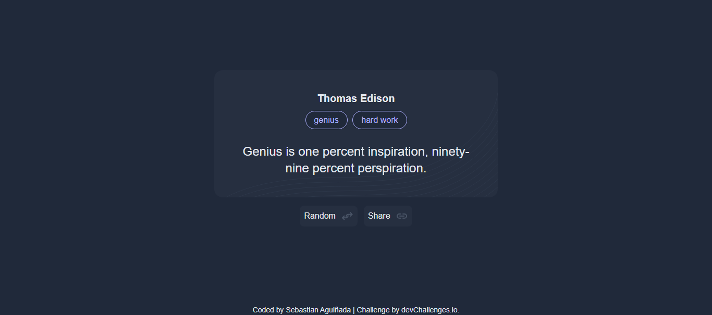

<h1 align="center">Random quote generator | devChallenges</h1>

   Solution for a challenge <a href="https://devchallenges.io/challenge/random-quote" target="_blank">Random Quote
</a> from <a href="http://devchallenges.io" target="_blank">devChallenges.io</a>.

  <h3>
    <a href="https://motivationalquotes-generator.netlify.app/">
      Demo
    </a>
     | 
    <a href="https://github.com/Sebascode20/random-quote-generator">
      Solution
    </a>
     | 
    <a href="https://devchallenges.io/challenge/random-quote">
      Challenge
    </a>
  </h3>

<!-- TABLE OF CONTENTS -->

## Table of Contents

- [Overview](#overview)
  - [What I learned](#what-i-learned)
  - [Useful resources](#useful-resources)
- [Built with](#built-with)
- [Features](#features)

<!-- OVERVIEW -->

## Overview

### What I learned

Project built with HTML, TailwindCSS, and JavaScript. During the project, I had the opportunity to learn how to use the utility classes provided by TailwindCSS to style websites, as well as to put Fetch into practice for accessing an online API and to practice manipulating the DOM with vanilla JavaScript.

### Useful resources

- [TailwindCSS Docs](https://tailwindcss.com/docs/) - This resource helped me figure out how to apply styles to my website using TailwindCSS

### Built with

- Semantic HTML5 markup
- [Tailwind](https://tailwindcss.com/)
- Vanilla JavaScript

## Features

This application/site was created as a submission to a [DevChallenges](https://devchallenges.io/challenges-dashboard) challenge.

## Author

- GitHub [@Sebascode20](https://github.com/Sebascode20)
